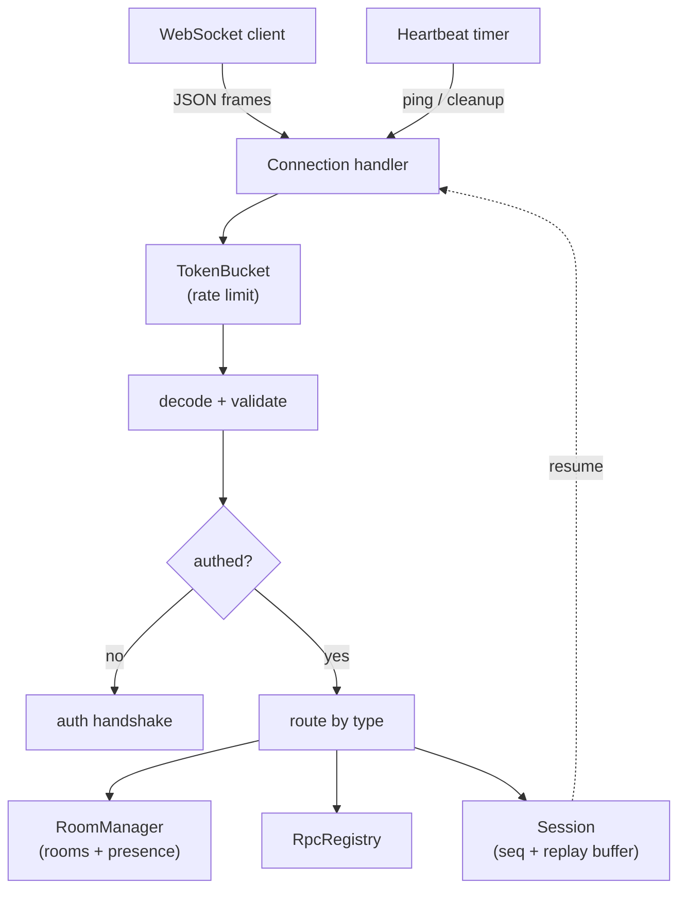

<div align="center">
  

  <h1>websocket-server-nodejs</h1>

  <p><strong>A production-grade, strictly-typed WebSocket server for Node.js — rooms, auth, heartbeats, presence, rate limiting, RPC, and reconnect/resume in one small package.</strong></p>

  <p><em>Built and maintained by Viprasol Tech.</em></p>

  <p>
    <a href="https://github.com/Viprasol-Tech/websocket-server-nodejs/actions"></a>
    <a href="LICENSE"></a>
    
    = 18" />
    
    
  </p>
</div>

---

## ✨ Features

- 🏠 **Rooms** — join/leave arbitrary string-keyed rooms; membership is tracked bidirectionally so disconnects clean up automatically.
- 🔐 **Auth handshake** — gate connections behind an `auth` token with a pluggable `authenticate(token)` that resolves a principal (identity + presence label).
- 💓 **Heartbeats & dead-client cleanup** — application-level ping/pong on a configurable cadence; clients that miss two beats are terminated. A WebSocket-level ping is also sent for proxy/LB keepalive.
- 👀 **Presence** — query who is in a room and get back the sorted roster of authenticated principals.
- 🚦 **Per-connection rate limiting** — a token-bucket limiter throttles inbound messages per socket; tune capacity and refill rate, or disable.
- 🔁 **Request/response (RPC)** — register named methods and call them over the same socket; replies are correlated by `id`.
- ♻️ **Reconnect / resume** — every connection gets a resumable session with a bounded replay buffer; a reconnecting client replays exactly what it missed.
- 📨 **Typed JSON protocol** — every frame is a discriminated `{ type, ... }` object with `encode`/`decode` helpers and a runtime type guard.
- 🧪 **Strict TypeScript** — ships `.d.ts` declarations; built on the battle-tested [`ws`](https://github.com/websockets/ws) library and covered by real `ws`-client integration tests.

## 📦 Install

```bash
npm install websocket-server-nodejs ws
```

> Requires Node.js 18+. `ws` is a peer you import directly when writing clients.

## 🚀 Quickstart

```ts
import { createServer } from "websocket-server-nodejs";

const server = await createServer(8080, {
  // Require an auth handshake; return a principal string to accept.
  authenticate: (token) => (token === process.env.WS_TOKEN ? "service-a" : null),
  heartbeatIntervalMs: 30_000,
  rateLimit: { capacity: 50, refillPerSecond: 25 },
});

// Expose a couple of RPC methods.
server.registerRpc("echo", (params) => params);
server.registerRpc("whoami", (_params, ctx) => ctx.principal);

console.log(`listening on ${server.port}`);
```

## 🛠️ Usage

### Server

```ts
import { createServer } from "websocket-server-nodejs";

const server = await createServer(8080);

// Broadcast programmatically (e.g. from a background job).
const delivered = server.broadcast("lobby", { hello: "world" });
console.log(`delivered to ${delivered} clients`);

// Inspect presence and shut down cleanly.
console.log(server.rooms.presence("lobby"));
await server.close();
```

### Client (using `ws`)

```ts
import { WebSocket } from "ws";
import { encode, decode } from "websocket-server-nodejs";

const ws = new WebSocket("ws://127.0.0.1:8080");

ws.on("open", () => {
  // 1. Authenticate, then join a room.
  ws.send(encode({ type: "auth", token: process.env.WS_TOKEN }));
  ws.send(encode({ type: "join", room: "lobby" }));

  // 2. Fire an RPC call (correlated by id).
  ws.send(encode({ type: "rpc", id: "1", method: "whoami" }));

  // 3. Ask who else is here.
  ws.send(encode({ type: "presence", room: "lobby" }));
});

ws.on("message", (raw) => {
  const msg = decode(raw.toString());
  switch (msg.type) {
    case "welcome":     // { sessionId } — keep it to resume later
    case "authed":      // { data: principal }
    case "rpc_result":  // { id, data }
    case "presence":    // { room, members }
      console.log(msg.type, msg);
      break;
    case "ping":
      ws.send(encode({ type: "pong" })); // keep the heartbeat alive
      break;
  }
});
```

### Reconnect / resume

```ts
// On a fresh connection the server sends { type: "welcome", sessionId, seq }.
// Persist `sessionId` and the highest `seq` you have processed.
// After a drop, reconnect and replay exactly what you missed:
ws.send(encode({ type: "resume", sessionId, seq: lastSeqSeen }));
// -> { type: "resumed", sessionId, seq } followed by the buffered messages.
```

## 🧭 Protocol

| Direction | Type | Fields | Meaning |
| --- | --- | --- | --- |
| C → S | `auth` | `token` | Authenticate the connection. |
| C → S | `join` / `leave` | `room` | Join or leave a room. |
| C → S | `message` | `room`, `data` | Broadcast to other room members. |
| C → S | `presence` | `room` | Request the room roster. |
| C → S | `rpc` | `id`, `method`, `data` | Invoke a registered RPC method. |
| C → S | `ping` / `pong` | — | Heartbeat liveness. |
| C → S | `resume` | `sessionId`, `seq` | Resume a session and replay missed frames. |
| S → C | `welcome` | `sessionId`, `seq` | Sent on connect; identifies the session. |
| S → C | `authed` | `data` (principal) | Auth succeeded. |
| S → C | `joined` / `left` | `room` | Acknowledgement. |
| S → C | `message` | `room`, `data`, `seq` | A broadcast frame. |
| S → C | `presence` | `room`, `members` | The room roster. |
| S → C | `rpc_result` / `rpc_error` | `id`, `data` | RPC reply, correlated by `id`. |
| S → C | `resumed` | `sessionId`, `seq` | Resume accepted; replay follows. |
| S → C | `error` | `data` | Malformed input, auth failure, or rate-limit. |

## 🧩 API

### `createServer(port, options?) => Promise<ServerHandle>`

| Option | Default | Description |
| --- | --- | --- |
| `host` | `127.0.0.1` | Interface to bind. |
| `requireAuth` | `true` if `authenticate` is set | Gate all ops behind `auth`. |
| `authenticate` | — | `(token) => principal \| null` (sync or async). |
| `heartbeatIntervalMs` | `30000` | Ping cadence; `0` disables. |
| `rateLimit` | `{ capacity: 50, refillPerSecond: 25 }` | Per-connection token bucket; `null` disables. |
| `resumeBufferSize` | `100` | Replay buffer size per session. |
| `sessionTtlMs` | `60000` | Inactivity TTL before a session is evicted. |
| `onMessage` | — | Hook called for every parsed inbound message. |

### `ServerHandle`

| Member | Description |
| --- | --- |
| `port` | Resolved TCP port (concrete even for `0`). |
| `wss` | Underlying `ws` `WebSocketServer`. |
| `rooms` | The `RoomManager` (membership + `presence`). |
| `rpc` | The `RpcRegistry`. |
| `sessions` | The resumable-session `SessionStore`. |
| `registerRpc(method, handler)` | Register an RPC method. |
| `broadcast(room, data, exclude?)` | Send to all room members; returns the count. |
| `close()` | Terminate connections and stop listening. |

### Building blocks

`RoomManager`, `TokenBucket`, `RpcRegistry`, `Session`, and `SessionStore` are all exported and independently usable, with full type declarations.

## 🗺️ Architecture



## ✅ Roadmap

- [x] Rooms, broadcast, and a typed JSON protocol
- [x] Auth handshake with pluggable token verification
- [x] Heartbeats with dead-client cleanup
- [x] Presence rosters per room
- [x] Per-connection token-bucket rate limiting
- [x] Request/response (RPC) over a single socket
- [x] Reconnect/resume with a replay buffer
- [ ] Pluggable backplane (Redis) for multi-node fan-out
- [ ] Per-method RPC schema validation
- [ ] Metrics/observability hooks (Prometheus)

## ❓ FAQ

**Does it scale across multiple Node processes?**
Each instance is self-contained today; cross-node fan-out (Redis backplane) is on the roadmap. For a single process it handles rooms, presence, and RPC out of the box.

**Do I have to use the auth handshake?**
No. Omit `authenticate` and connections are treated as anonymous (`requireAuth` defaults to `false`). Provide `authenticate` to require a token.

**What happens if a resume buffer has expired?**
The server replies with an `error` ("cannot resume…") and keeps the fresh session it assigned on connect, so the client can resynchronize from scratch.

**Is it tied to a framework?**
No — it is a thin, typed layer over [`ws`](https://github.com/websockets/ws) with zero runtime dependencies beyond it.

## 🧑‍💻 Development

```bash
npm install
npm run typecheck   # tsc --noEmit
npm test            # vitest run
npm run build       # tsc -> dist/
```

## 🤝 Contributing

Contributions are welcome. Please open an issue to discuss substantial changes first, keep the build green (`npm run typecheck && npm test`), and follow the existing code style. See [CONTRIBUTING.md](CONTRIBUTING.md) and our [Code of Conduct](CODE_OF_CONDUCT.md).

## Contact — Viprasol Tech Private Limited

- Website: [viprasol.com](https://viprasol.com)
- Email: [support@viprasol.com](mailto:support@viprasol.com)
- Telegram: [t.me/viprasol_help](https://t.me/viprasol_help) | WhatsApp: +91 96336 52112
- GitHub: [@Viprasol-Tech](https://github.com/Viprasol-Tech) | [LinkedIn](https://www.linkedin.com/in/viprasol/) | X [@viprasol](https://twitter.com/viprasol)

## License

[MIT](LICENSE) (c) 2025 Viprasol Tech Private Limited
